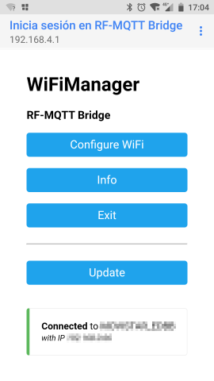
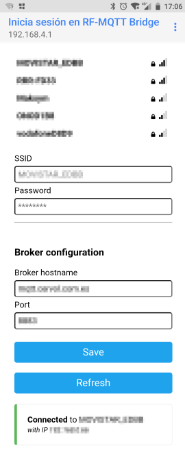
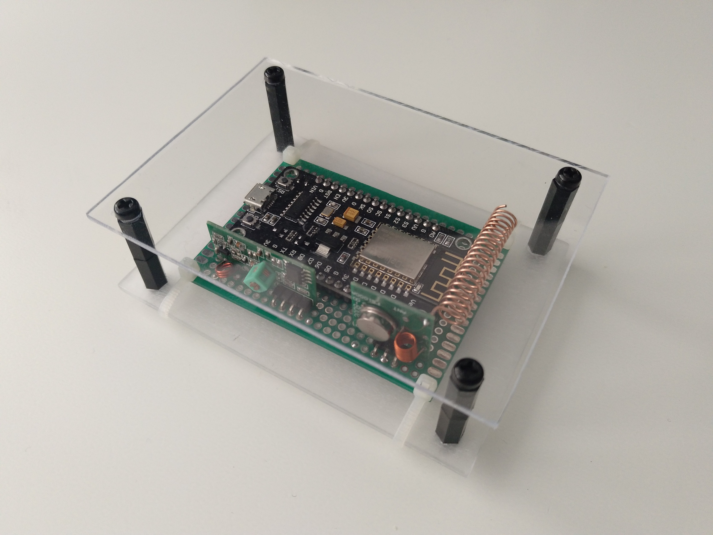
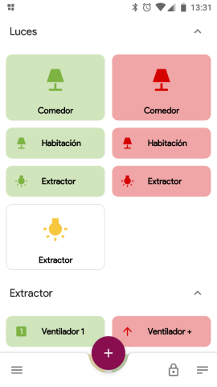

# RF-MQTT Bridge

This a quick weekend project I have created with a NodeMCU v3 (ESP8266) microcontroller, and the inexpensive FS1000A and XY-MK-5V emitter and receiver radiofrequency modules.

This project starts with the desire of giving "smart" capabilities to my [Novy Pureline cooker hood](https://www.novy.com/products/cooker-hoods/) which is controlled by a [Novy 840029 remote control](https://www.novy.com/products/accessories/remote-control/remote-control/840029/) that uses radifrecuancy signals at 433 Mhz. In order to integrate the cooker hood in my "smart home" environment, I wanted to create an MQTT-based interface which transformed MQTT messages into proper RF commands which can be understood by the cooker hood.

Once I had everything working, and since I also had some other RF-controlled devices, such as the [Etekcity Zap Remote Outlet Switches](https://www.etekcity.com/products/remote-outlet-zap-5lx-s) (well, the [european version](https://www.amazon.es/dp/B016I3TZ58)), I also added support for them in the microcontroller code.

To communicate with the different devices I used the [rc-switch library](https://github.com/sui77/rc-switch). I had to discover the actual protocol being used the devices by sniffing the packets sent by the different remotes. For the *Etekcity Zap* remotes the [example code of the rc-switch project](https://github.com/sui77/rc-switch/tree/master/examples/ReceiveDemo_Advanced) worked correctly, and it was able to detect the *protocol* and the *pulseL length* of the switches on a first try. For the *Novy 840029 remote control* it was trickier, since the protocol was incorrectly identified. Nevertheless, based on the protocal data specification in the [SIGNALduino - FHEM Modules Version project](https://github.com/RFD-FHEM/RFFHEM/blob/8f37152d0a98301b05968c563a1f37beea8949cd/FHEM/lib/SD_ProtocolData.pm#L2321) I was able to properly identify the right protocol.

## Wiring

**NOTE:** The NodeMCU micrcontroller should be powered via its USB port.

| Device Pin    | NodeMCU Pin |
|:-------------:|:-----------:|
| FS1000A Vcc   | VU          |
| FS1000A Gnd   | G           |
| FS1000A Data  | D1          |
| XY-MK-5V Vcc  | VU          |
| XY-MK-5V Gnd  | G           |
| XY-MK-5V Data | D6          |

## Configuration

The RF-MQTT Bridge can be configured using the [WiFiManager library](https://github.com/tzapu/WiFiManager).

Besides the wifi SSID and password, the address and port of an MQTT broker must be provided.

The wifi access point used to configure the RF-MQTT Bridge will be automatically launched if no wifi network has been previously configured.

It is also possible to launch the configuration access point manually at any point. To do so, press the FLASH button while the board is on until the board buil-in led quickly flashes for 10 times. 

## Final product

This is what the final device looks like. If you want to increase the coverage of the RF signals, you can build an antenna using a ~34,6cm copper wire (the inner copper wire of a coaxial cable would serve) and a screwdriver.

Once the device is running, you can use the MQTT dashboard application of your liking to send commands to your Novy cooker hood or your power outlets.

